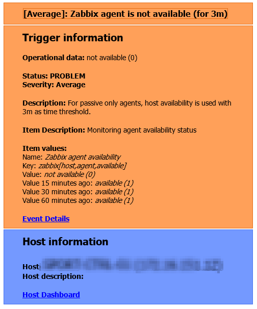

# zabbix-htmlmailtemplates
Replaces the original problem and problem recovery message types in the HTML email media type.

Includes direct links to triggered event and host dashboard. Update the files with your domain name in the url
so the links for event and dashboard points to your environment.

I also changed the subject to this:
```
Problem: [{TRIGGER.SEVERITY} {HOST.HOST}] {EVENT.NAME}
OK: [Resolved {HOST.HOST}] in {EVENT.DURATION}: {EVENT.NAME}
```


Example new Average Problem:



Example Recovered Average Problem:


